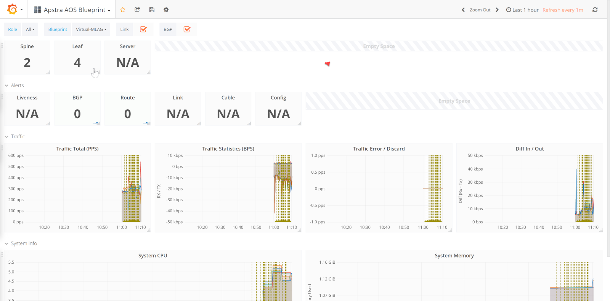
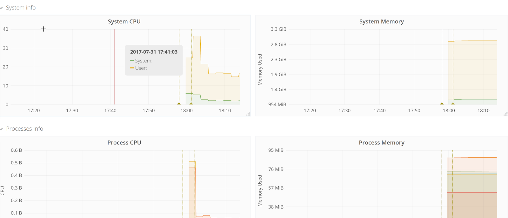

###############
AOSOM-Streaming
###############

Version v0.6.1

The Aosom Streaming project provides a packaged solution to collect
and visualize telemetry streaming information coming from an AOS Server.
This provides a Web UI experience and example queries to handle alerts,
counters, and AOS events.
This project officially lives on Github at https://github.com/Apstra/aosom-streaming
and is open-source.

The packaged solution includes:

* A graphical Interface based on Grafana (port 3000)
* Prometheus for Counters and Alerts (port 9090)
* Influxdb for Events (port 8086)
* 2 Collectors, one for each database based on Telegraf.

The application must first be configured by modifying
``variables.env``, then ``make clean``, ``make start``, ``make init``
to customize the IP addresses to your environment.

*********************
Using Aosom-streaming
*********************

Grafana Web UI
==============
You can browse to the Grafana web UI by visiting http://<aosom-streaming>:3000
The default username is admin password admin

The grafana web UI includes two main sections (top left) - Apstra AOS
Blueprint, which describes overall telemetry alerts and traffic throughput,
as well as individual devices for interface telemetry.  The blueprints will
be learned automatically using the AOS ‘telegraf’ docker container and no
further configuration is necessary - it should all be automatic.

In the screenshot above, we can observe traffic in the demo AOS environment,
and aggregate CPU, traffic, and errors.

Change the dashboard at the to ‘Apstra AOS Device’ to filter telemetry
events based on specific and individual devices.  Here we can observe
there are 2 active route anomalies in the blueprint, and AOS has received
telemetry for two leaf switches.

We can scroll down and view device statistics such as CPU and Memory:

Prometheus Web UI
=================
Prometheus is used for alerts and device telemetry counter storage in the
Aosom-streaming appliance.  Prometheus is available by browsing
to http://<aosom-streaming>:9090

Each of the queries are built dynamically by AOS when incoming events
appear.  Begin typing under ‘execute’ to see example query names.  Starting
with ‘alert’ will tab-complete available alerts that prometheus has received
from AOS.

.. image:: images/prometheus_default.png

Here is an example of BGP Neighbors being offline.

.. image:: images/prometheus_bgp_down.png

InfluxDB
========
InfluxDB is used to store AOS events from telemetry streaming.  InfluxDB is
available by viewing http://<aosom-streaming>:8083

We can show the available influxdb keys with queries, such as ‘show field keys’
or ‘show measurements’.

Once we know a measurement, we can view the data and keys with select 8 from
<measurement> -- In this case, we’ll  capture the LAG interface status.

.. note::

    Developing an influx-db application is beyond the scope of this documentation.
    If you would like to extend capability or develop an application based on
    telemetry streaming, please let us know and we would be happy to help.

*****************************
Aosom-Streaming configuration
*****************************

Configuring telemetry streaming as part of this project only requires editing
the ‘variables.env’ file and restarting  the containers.  No configuration is
necessary on the AOS server.

Aosom-Streaming VM Setup
========================
This step is only applicable if you are using the Apstra-provided OVA file from
files.apstra.com for Aosom-streaming, otherwise skip to Aosom-Streaming
application setup.

.. note::

    The default appliance credentials are username `aosom` and password `admin`

By default, this appliance ships with the first network interface (`ens33`)
configured for DHCP.

.. code-block:: text

    aosom@ubuntu:~/aosom-streaming$ cat /etc/network/interfaces
    # This file describes the network interfaces available on your system
    # and how to activate them. For more information, see interfaces(5).

    source /etc/network/interfaces.d/*

    # The loopback network interface
    auto lo
    iface lo inet loopback

    # The primary network interface
    auto ens33
    iface ens33 inet dhcp

Network configuration can be changed to a static IP address:

.. code-block:: text

    # The primary network interface
    auto eth0
    iface eth0 inet static
     address 192.168.57.35
     netmask 255.255.255.0
     gateway 192.168.57.2
     dns-nameservers 192.168.57.2

Aosom-Streaming Application setup
=================================

Setting up the Aosom-streaming docker container only requires you to modify
``variables.env``, and run ``make start``.  Documentation for starting, stopping,
and clearing data is available at https://github.com/Apstra/aosom-streaming

The telegraf project connects to the AOS API and posts an IP:Port that AOS
uses to stream realtime telemetry data back to.

Setting up Aosom-streaming
--------------------------

Copy `variables.default` to `variables.env`:

.. code-block:: text

    aosom@ubuntu:~/aosom-streaming$ cp variables.default variables.env

Modify variables.env
--------------------
``AOS_SERVER`` should be the IP address of the AOS server that will send
telemetry data to the aosom-streaming server.  Username, port and password
information can be customized.

“LOCAL_IP” should be the IP address assigned to ens33 (first ethernet
interface)

In this case, this is learned via DHCP on this VM.  See
``ip addr show dev ens33``

GRAFANA configuration options specify the username and password for the
grafana web UI.

.. code-block:: text

    AOS_SERVER=192.168.57.250
    LOCAL_IP=192.168.57.128

    INPUT_PORT_INFLUX=4444
    INPUT_PORT_PROM=6666
    AOS_LOGIN=admin
    AOS_PASSWORD=admin
    AOS_PORT=443

    GRAFANA_LOGIN=admin
    GRAFANA_PASSWORD=admin

Set up the project with ``make start``, or if making configuration
changes, run ``make update``.

.. code-block:: text

    aosom@ubuntu:~/aosom-streaming$ make start
    -- Start all components --
    Creating network "aosomstreaming_default" with the default driver
    Creating volume "aosomstreaming_grafana_data_2" with default driver
    Pulling telegraf-influx (apstra/telegraf:1.2)...
    1.2: Pulling from apstra/telegraf
    00d19003217b: Pull complete
    72dd23d7de04: Pull complete
    cf6581f43cce: Pull complete
    Digest: sha256:1539d4b84618abb44bdffb1e0a27399a7272814be36535f4a7dfa04661d6e5f6
    Status: Downloaded newer image for apstra/telegraf:1.2
    Pulling prometheus (prom/prometheus:v1.5.2)...
    v1.5.2: Pulling from prom/prometheus
    557a0c95bfcd: Pull complete
    a3ed95caeb02: Pull complete
    caf4d0cf9832: Pull complete
    ee054001e2db: Pull complete
    b95bf6c4c81b: Pull complete
    86503a6ba368: Pull complete
    ff27c7b0b50e: Pull complete
    534e30a17a42: Pull complete
    475d41733562: Pull complete
    Digest: sha256:e049c086e35c0426389cd2450ef193f6c18b3d0065b97e5f203fdb254716fa1c
    Status: Downloaded newer image for prom/prometheus:v1.5.2
    Pulling influxdb (influxdb:1.1.1-alpine)...
    1.1.1-alpine: Pulling from library/influxdb
    0a8490d0dfd3: Pull complete
    5f0fd352f87d: Pull complete
    873718bcf8aa: Pull complete
    3fbaf3e4140e: Pull complete
    Digest: sha256:e0184202151b2abb9ceee79e6523d9492fc3c632324eb6f7bf1a672dd130a3bb
    Status: Downloaded newer image for influxdb:1.1.1-alpine
    Pulling grafana (grafana/grafana:4.1.2)...
    4.1.2: Pulling from grafana/grafana
    43c265008fae: Pull complete
    c2ab838d4052: Pull complete
    e8a816c8f505: Pull complete
    Digest: sha256:05d925bd64cd3f9d6f56a4353774ccec588586579ab738f933cd002b7f96aca3
    Status: Downloaded newer image for grafana/grafana:4.1.2
    Creating aosomstreaming_telegraf-influx_1
    Creating aosomstreaming_prometheus_1
    Creating aosomstreaming_telegraf-prom_1
    Creating aosomstreaming_influxdb_1
    Creating aosomstreaming_grafana_1

****************
Makefile options
****************

Start all containers
====================
To start all components, you can execute the command ``make start``

Initialize Grafana
==================
After the first boot, you need to initialize Grafana with ``make init`` to:

* Configure Datasource
* Upload Dashboards

Reset project
=============
At any time, you can reset the project but running the command ``make clean``.

.. note::

    * All components must be stopped before cleaning-up
    * The next time you start the project you'll have to do a `init` again.

Make options
============

Other options available for MAKE are::

    Available targets

    help                           This help screen
    start                          Start all components
    stop                           Stop all components
    init                           Create datasources (proxy) in grafana and load Dashboards (grafana-create-source-proxy grafana-load-dashboards)
    grafana-create-source-proxy    Create datasource in proxy mode in Grafana
    grafana-create-source-direct   Create datasource in direct mode in Grafana (use that is grafana cannot access the data)
    grafana-load-dashboards        Load/Reload the Dashboards in Grafana
    update                         Stop all components, Update all images, Restart all components, Reload the Dashboards (stop update-docker start grafana-load-dashboards)
    update-docker                  Update Docker Images
    clean                          Delete Grafana information and delete current streaming session on AOS (clean-docker clean-aos)
    clean-docker                   Delete Grafana information
    clean-aos                      Delete current streaming session on AOS

***********************************
(Optional) Build Aosom-Streaming VM
***********************************

These are the simple steps to build your own Aosom-streaming VM - at the
end of the day, Aosom-Streaming is only a simple Docker container, and this
guide is only setting up a very basic docker server.

Install Ubuntu 16.04.2
======================

Download the Ubuntu 16.04.2 ISO and provision a new VM.

The default username we’ve chosen is ‘aosom’ with password ‘admin’.
For larger blueprints, Apstra recommends changing RAM to at least 8GB
and 2 vCPU to or more.

========  ========
Resource  Quantity
========  ========
RAM       8GB
CPU       2vCPU
Network   1 vNIC
========  ========

Install required packages
=========================

Based on Ubuntu 16.04.2

Run apt-get update::

    apt-get update

Perform a system update to ensure all packages are up to date.::

    aosom@ubuntu:~$ sudo apt-get install docker docker-compose git make curl
        openssh-server
    [sudo] password for aosom:
    Reading package lists... Done
    Building dependency tree
    Reading state information... Done
    The following additional packages will be installed:
      bridge-utils cgroupfs-mount containerd dns-root-data dnsmasq-base docker.io
      git-man liberror-perl libnetfilter-conntrack3 libperl5.22 libpython-stdlib
      libpython2.7-minimal libpython2.7-stdlib libyaml-0-2 patch perl
      perl-modules-5.22 python python-backports.ssl-match-hostname
      python-cached-property python-cffi-backend python-chardet
      python-cryptography python-docker python-dockerpty python-docopt
      python-enum34 python-funcsigs python-functools32 python-idna
      python-ipaddress python-jsonschema python-minimal python-mock
      python-ndg-httpsclient python-openssl python-pbr python-pkg-resources
      python-pyasn1 python-requests python-six python-texttable python-urllib3
      python-websocket python-yaml python2.7 python2.7-minimal rename runc
      ubuntu-fan xz-utils
    Suggested packages:
      mountall aufs-tools btrfs-tools debootstrap docker-doc rinse zfs-fuse
      | zfsutils git-daemon-run | git-daemon-sysvinit git-doc git-el git-email
      git-gui gitk gitweb git-arch git-cvs git-mediawiki git-svn diffutils-doc
      perl-doc libterm-readline-gnu-perl | libterm-readline-perl-perl make
      python-doc python-tk python-cryptography-doc python-cryptography-vectors
      python-enum34-doc python-funcsigs-doc python-mock-doc python-openssl-doc
      python-openssl-dbg python-setuptools doc-base python-ntlm python2.7-doc
      binutils binfmt-support make
    The following NEW packages will be installed:
      bridge-utils cgroupfs-mount containerd dns-root-data dnsmasq-base docker
      docker-compose docker.io git git-man liberror-perl libnetfilter-conntrack3
      libperl5.22 libpython-stdlib libpython2.7-minimal libpython2.7-stdlib
      libyaml-0-2 patch perl perl-modules-5.22 python
      python-backports.ssl-match-hostname python-cached-property
      python-cffi-backend python-chardet python-cryptography python-docker
      python-dockerpty python-docopt python-enum34 python-funcsigs
      python-functools32 python-idna python-ipaddress python-jsonschema
      python-minimal python-mock python-ndg-httpsclient python-openssl python-pbr
      python-pkg-resources python-pyasn1 python-requests python-six
      python-texttable python-urllib3 python-websocket python-yaml python2.7
      python2.7-minimal rename runc ubuntu-fan xz-utils make
    0 upgraded, 54 newly installed, 0 to remove and 3 not upgraded.
    Need to get 32.4 MB of archives.
    After this operation, 174 MB of additional disk space will be used.
    Do you want to continue? [Y/n] y

Add the aosom user to the docker group.  This will allow ‘aosom’
to make docker configuration changes without having to escalate to sudo.

Add user to docker::

    aosom@ubuntu:~/aosom-streaming$ sudo usermod -aG docker aosom
    Log out and log back in again for ‘aosom’ user to be properly added to the group.

Copy the Aosom-streaming docker containers over with ‘git clone’::

    aosom@ubuntu:~$ git clone https://github.com/Apstra/aosom-streaming.git
    Cloning into 'aosom-streaming'...
    remote: Counting objects: 303, done.
    remote: Total 303 (delta 0), reused 0 (delta 0), pack-reused 303
    Receiving objects: 100% (303/303), 64.10 KiB | 0 bytes/s, done.
    Resolving deltas: 100% (176/176), done.
    Checking connectivity... done.
    aosom@ubuntu:~$

Set container restart policy
============================

The AOSOM-Streaming package does not set the docker restart policy,
and this is up to your orchestration toolchain. Open
aosom-streaming/docker-compose.yml and add ``restart: always`` to each of
the service directives.  This will ensure docker containers will be online
after a service reboot.

Modifying docker options::

    aosom@ubuntu:~/aosom-streaming$ git diff docker-compose.yml
    diff --git a/docker-compose.yml b/docker-compose.yml
    index 799d4c5..0d0fcc2 100644
    --- a/docker-compose.yml
    +++ b/docker-compose.yml
    @@ -16,6 +16,7 @@ services:
           - prometheus
         ports:
           - "3000:3000"
    +    restart: always

     # -------------------------------------------------------------------------
     # Prometheus -
    @@ -30,6 +31,7 @@ services:
             - '-config.file=/etc/prometheus/prometheus.yml'
         ports:
             - '9090:9090'
    +    restart: always

     # -------------------------------------------------------------------------
     # influxdb
    @@ -43,6 +45,7 @@ services:
         ports:
          - "8083:8083"
          - "8086:8086"
    +    restart: always

     # -------------------------------------------------------------------------
     # Telegraf - Prom
    @@ -57,6 +60,7 @@ services:
           - /etc/localtime:/etc/localtime
         ports:
             - '6666:6666'
    +    restart: always

     # -------------------------------------------------------------------------
     # Telegraf - Influx
    @@ -71,3 +75,4 @@ services:
           - /etc/localtime:/etc/localtime
         ports:
             - '4444:4444'
    +    restart: always

Set up ``variables.env`` and start container as per Aosom-Streaming
application setup section.

Change system hostname
======================
Modify /etc/hostname to `aosom`, and change the loopback IP in /etc/hosts
to `aosom` from `ubuntu`.

***************
Troubleshooting
***************

While most troubleshooting information is included in the Github main page at
https://github.com/Apstra/aosom-streaming, we can run some simple commands to
make sure the environment is healthy

Checking for logs from AOS to Aosom-streaming
=============================================

Run docker logs aosomstreaming_telegraf-influx_1

We should see a blueprint ID, and some influxdb ‘write’ events when telemetry
events occur on AOS - BGP, liveness, config deviation, etc.

Viewing docker logs::

    GetBlueprints() - Id 0033cf3f-41ed-4ddc-91f5-ea68318fba9b
    2017-07-31T23:59:13Z D! Finished to Refresh Data, will sleep for 20 sec
    2017-07-31T23:59:15Z D! Output [influxdb] buffer fullness: 11 / 10000 metrics.
    2017-07-31T23:59:15Z D! Output [influxdb] wrote batch of 11 metrics in 5.612057ms
    2017-07-31T23:59:20Z D! Output [influxdb] buffer fullness: 4 / 10000 metrics.
    2017-07-31T23:59:20Z D! Output [influxdb] wrote batch of 4 metrics in 5.349171ms
    2017-07-31T23:59:25Z D! Output [influxdb] buffer fullness: 11 / 10000 metrics.
    2017-07-31T23:59:25Z D! Output [influxdb] wrote batch of 11 metrics in 4.68295ms
    2017-07-31T23:59:30Z D! Output [influxdb] buffer fullness: 4 / 10000 metrics.
    2017-07-31T23:59:30Z D! Output [influxdb] wrote batch of 4 metrics in 5.007029ms
    GetBlueprints() - Id 0033cf3f-41ed-4ddc-91f5-ea68318fba9b
    2017-07-31T23:59:33Z D! Finished to Refresh Data, will sleep for 20 sec

Ensuring all containers are running
===================================
Run ``docker ps`` to see and ensure all the expected containers are running:

Listing docker containers::

    aosom@ubuntu:~/aosom-streaming$ docker ps
    CONTAINER ID        IMAGE                    COMMAND                  CREATED             STATUS              PORTS                                            NAMES
    e03d003a2ef9        grafana/grafana:4.1.2    "/run.sh"                3 minutes ago       Up 3 minutes        0.0.0.0:3000->3000/tcp                           aosomstreaming_grafana_1
    3042d45f1107        prom/prometheus:v1.5.2   "/bin/prometheus -con"   3 minutes ago       Up 3 minutes        0.0.0.0:9090->9090/tcp                           aosomstreaming_prometheus_1
    429328fbb5ac        apstra/telegraf:1.2      "telegraf -debug"        3 minutes ago       Up 3 minutes        0.0.0.0:6666->6666/tcp                           aosomstreaming_telegraf-prom_1
    0a84241e1366        apstra/telegraf:1.2      "telegraf -debug"        3 minutes ago       Up 3 minutes        0.0.0.0:4444->4444/tcp                           aosomstreaming_telegraf-influx_1
    f4d2deb0e428        influxdb:1.1.1-alpine    "/entrypoint.sh influ"   3 minutes ago       Up 3 minutes        0.0.0.0:8083->8083/tcp, 0.0.0.0:8086->8086/tcp   aosomstreaming_influxdb_1

Disclaimer
==========
WARNING: This application is for demo purposes only and should not be used in production.
